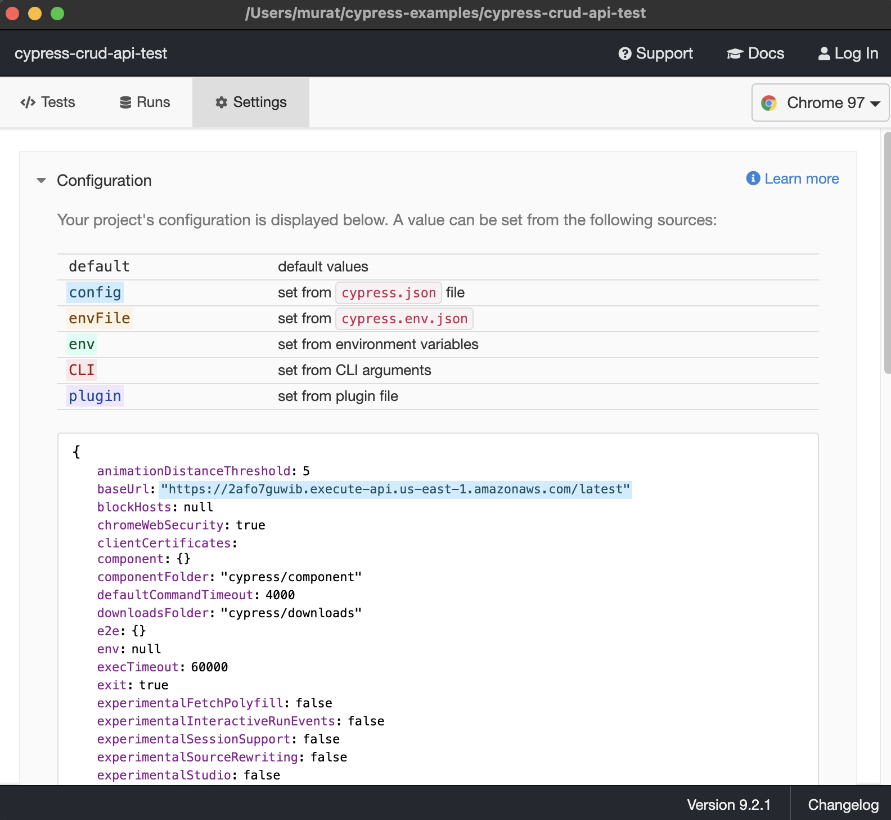
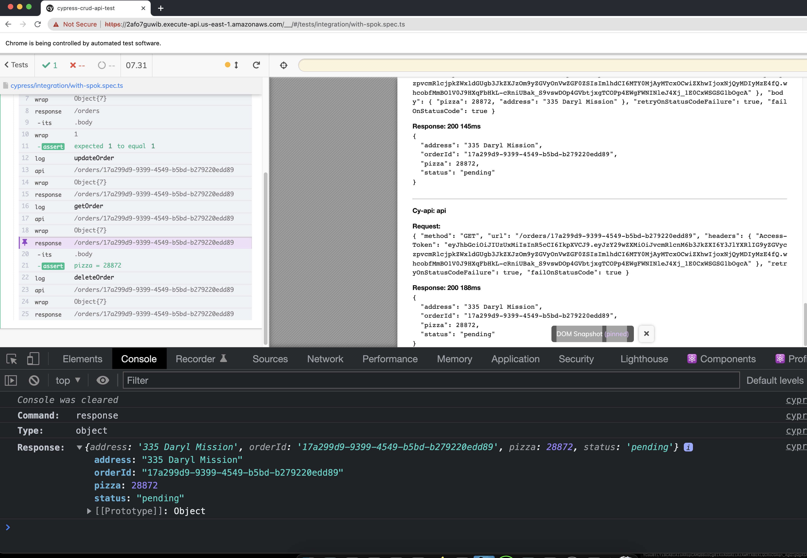
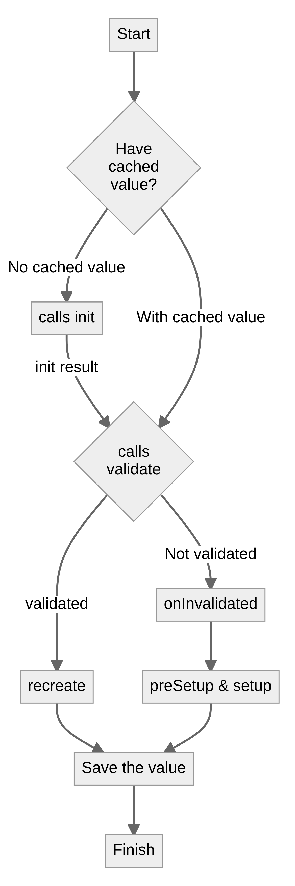
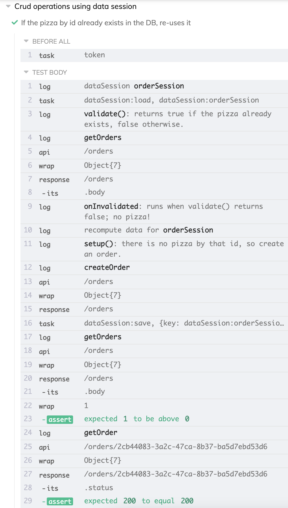
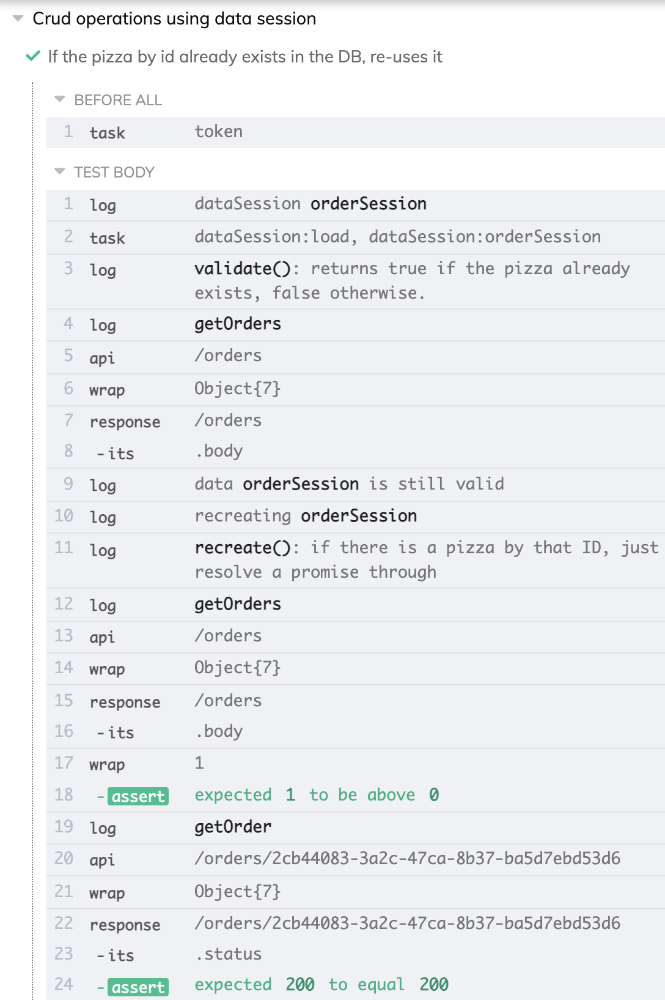
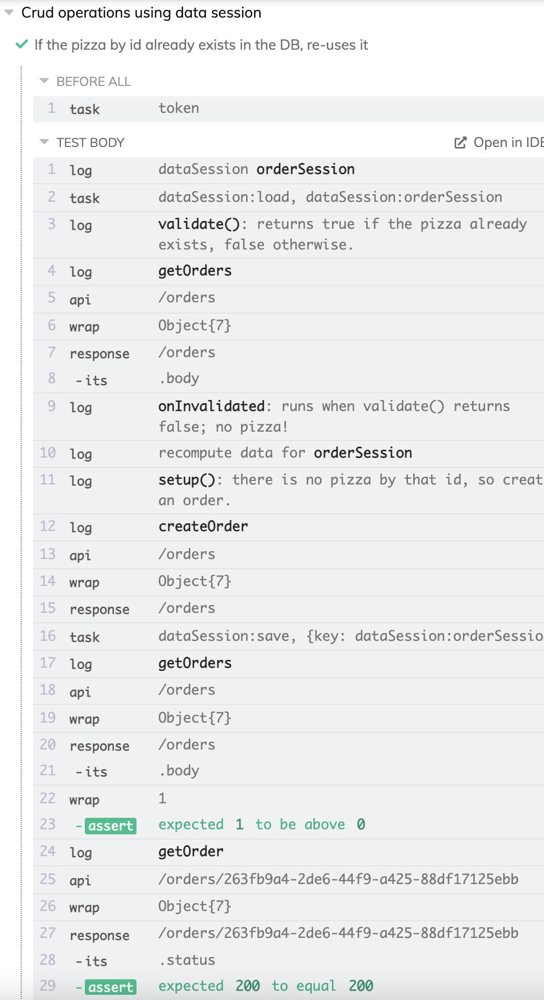

## A guide to API CRUD Api testing a deployed service with Cypress    

```bash
yarn install
yarn cy:open
yarn cy:run
```

For learning purposes, you can check out the branch `base` to start from scratch and follow the guide. `main` has the final version of the repo. The code samples are setup to copy paste into the repo and work at every step.

### The Service under test

The service we are using in this example is Aunt Maria's Pizzaria from the book [Serverless Applications with Node.js](https://www.manning.com/books/serverless-applications-with-node-js).

Since we are API testing the service, the implementation details are not critical. For those that are interested, it is a AWS serverless app that is deployed via [ClaudiaJs](https://claudiajs.com/), and the source code can be found [here](https://github.com/muratkeremozcan/books/tree/master/aws/claudiajs/pizza-api).

There is a `test.rest` file in the repo root that can help us get familiar with the API. It uses [VsCode REST Client](https://marketplace.visualstudio.com/items?itemName=humao.rest-client) extension to test the api like we would do with Postman.

### Token simulation

The API does not require authentication, but we want to showcase how to work with similar variables in a test spec. In the real world we would have a function to acquire a token from an authorization endpoint, but here we will keep it simple and utilize scripts to generate various signed tokens. Instead of a function, we will take the opportunity showcase [cy.task](https://docs.cypress.io/api/commands/task) which allows us to run any JS/TS code within the context of Cypress.

Let's `yarn add -D jsonwebtoken` and create `./scripts/cypress-token.ts` . The content should be as such:

```typescript
import { sign } from 'jsonwebtoken'

export const token = (pw = 'Password123') =>
  sign(
    { scopes: 'orders:order:create orders:order:delete orders:order:update' },
    pw,
    {
      algorithm: 'HS512',
      expiresIn: '10m'
    }
  )
```

Import the function into our `cypress/plugins/index.ts` file so that we can use it. Import the token function and add a task for the token.

```typescript
import * as token from '../../scripts/cypress-token'

const cyDataSession = require('cypress-data-session/src/plugin')

/**
 * @type {Cypress.PluginConfig}
 */
module.exports = (on, config) => {
  // `on` is used to hook into various events Cypress emits
  // `config` is the resolved Cypress config

  // our new task
  on('task', token)

  const allConfigs = Object.assign(
    {},
    // add plugins here
    cyDataSession(on, config)
  )

  return allConfigs
}
```

> Check out the video [5 mechanics around cy.task and the plugin file](https://www.youtube.com/watch?v=2HdPreqZhgk) for more knowledge on the topic.

Now let us go to the spec file at `./cypress/integration/spec.ts` and write a test to make sure that we get a string from this function.

> Note that Cypress re-executes spec files on saved changes, but if the `plugins/index` file is changed we have to stop Cypress test runner and start the test again.

```typescript
describe('Crud operations', () => {
  it('gets token', () => {
    cy.task('token').should('be.a', 'string')

    // if we want to specify the argument this fn should be called with
    cy.task('token', 'myOwnPassword').should('be.a', 'string')
  })
})
```

Cypress has a declarative chaining syntax that pipes inputs and outputs. Most of the time, you do not even need to deal with the values going through the chain. Async/await makes it much easier to unwrap values, but [Commands are not Promises](https://docs.cypress.io/guides/core-concepts/introduction-to-cypress.html#Commands-Are-Not-Promises), using `await` on a Cypress chain will not work as expected. This is a [very conscious and important design decision](https://docs.cypress.io/faq/questions/using-cypress-faq#Can-I-use-the-new-ES7-async-await-syntax) that gives Cypress a fluid, functional programming inspired, observable-stream-like api that many begin to prefer over what they have been used to.

We will usually want to acquire a token and build a state before our e2e tests. This happens in the before hooks. Here we want to get a token before the tests begin, and make the token value available throughout the test. This flow applies to any data-entity dependencies of our test. For example let's assume to test entity C, A & B dependencies are required. The approach to working with A and B would be the same as working with the token in this example.

In Cypress there are [three ways to access values from before hooks within the tests](aq/questions/using-cypress-faq#Can-I-use-the-new-ES7-async-await-syntax). In this exercise, we use the one we find to be cleanest. Let us make sure we get a token in a before block, and access that value in the it block.

```typescript
describe('Crud operations', () => {
  let token

  // assign the value we get to our token variable
  before(() => cy.task('token').then((t) => (token = t)))

  it('gets token', () => {
    // log to the runner (we can also log to DevTools via console.log)
    cy.log(token)
  })
})
```

In the real world we might have a situation where we need to test entity C, but it depends on entity A & B to exist first.

```typescript
describe('C depends on A, B and a token', () => {
  let adminToken
  let entityAId
  let entityBId

  before(() =>
    cy
      .getToken()
      .then((token) => (adminToken = token))
      .then(() => cy.createEntityA(adminToken).then((A) => (entityAId = A.id)))
      .then(() =>
        cy.createEntityB(adminToken, entityAId).then((B) => (entityBId = B.id))
      )
  )

  it('uses the adminToken, entityBId or even entityAId in the tests', () => {})
})
```

### Configure our baseUrl

We need our unique AWS stack base url. Let us add it to Cypress config at `./cypress.json.`

> Set the viewportWidth too so that cy.api uses the right pane real estate.

```typescript
{
  "baseUrl": "https://2afo7guwib.execute-api.us-east-1.amazonaws.com/latest",
  "viewportWidth": 1000
}
```

Once this change is made, we can observe the Cypress runner restart. If we go to the Settings tab and expand Configuration, we can spot our `baseUrl`. Note that there are a plethora of ways to configure Cypress (cypress.json, cypress.env.json, config folder etc.) and all valid configuration values get reflected here; it is a good way to test if what you configured works locally.



### GET the baseUrl

Let us try to GET the baseUrl. The syntax for Cypress [request api](https://docs.cypress.io/api/commands/request) is simple; method, url, headers.

> This API does need a token, but if it did, that is where it would go.

```typescript
describe('Crud operations', () => {
  let token
  // assign the value we get to our token variable
  before(() => cy.task('token').then((t) => (token = t)))

  it('gets an order', () => {
    cy.api({
      method: 'GET',
      url: `/`,
      headers: {
        'Access-Token': token
      }
    })
  })
})
```

Using the time travel debugger, click and observe each step. The right pane will display the same information you would find in DevTools.


### Our crud e2e test strategy

Before we get to assertions, let us write out the full crud operation first. Our API e2e testing strategy is to cover the update case, which inadvertently covers create, get, update and delete. Why is this? Cypress can test both UIs and APIs, so think of a UI crud operation where you are setting up state or cleaning up via api calls and isolating the UI testing to the feature:

1. Creation

- UI create
- API delete

2. Update

- API create
- UI update
- API delete

3. Delete

- API create
- UI delete

That is a good way to test your UI pieces in isolation, while using api calls to setup & tear down state.

Now, replace “UI” with “api”. It is all overlapping; Update case covers it all.

### POST an order

Let us create our own pizza order update it and delete it at the end.

Let us start with the POST request. You see the similar api, where we added the body as the payload.

Let us add the `@withshepherd/faker` library to create a randomized body: `yarn add -D @withshepherd/faker`, and remove the original faker from the packages.

> More on [what happened to faker](https://www.youtube.com/watch?v=R6S-b_k-ZKY).

```typescript
import { datatype, address } from '@withshepherd/faker'

describe('Crud operations', () => {
  let token

  before(() => cy.task('token').then((t) => (token = t)))

  it('cruds an order', () => {
    cy.api({
      method: 'POST',
      url: `/orders`,
      headers: {
        'Access-Token': token
      },
      body: {
        pizza: datatype.number(),
        address: address.streetAddress()
      }
    })
  })
})
```

For now, using the `test.rest` file execute `GET {{baseUrl}}/orders`, our order should be there. We want a way to confirm that with Cypress. The POST does not respond with a body, and all we know from the test context can be pizzaId. We will have to dig into the orders, filter by pizzaId, and verify if the order we posted exists.

> Loadash is bundled in Cypress, and we will use that to filter the object; no need to wrestle the data. For a comparison of array vs lodash check out [this repo](https://github.com/muratkeremozcan/sorted-table-example/blob/main/cypress/integration/1.array-vs-lodash-vs-ramda.spec.js).

Note that we also yield the response.body using `its('body')`. [its](https://docs.cypress.io/api/commands/its) is a connector in Cypress which yields a property's value on the previously yielded subject. It has Cypress function level [retry-ability](https://docs.cypress.io/guides/core-concepts/retry-ability) built-in to it, so it will retry the api call until that property is exists; i.e. the response to the GET request has a `body` property.

```typescript
import { datatype, address } from '@withshepherd/faker'

describe('Crud operations', () => {
  let token

  before(() => cy.task('token').then((t) => (token = t)))

  it('cruds an order', () => {
    const pizzaId = datatype.number()

    cy.api({
      method: 'POST',
      url: `/orders`,
      headers: {
        'Access-Token': token
      },
      body: {
        pizza: pizzaId,
        address: address.streetAddress()
      }
    })

    cy.api({
      method: 'GET',
      url: `/orders`,
      headers: {
        'Access-Token': token
      }
    })
      .its('body')
      .should((orders) => {
        const ourPizza = Cypress._.filter(
          orders,
          (order) => order.pizza === pizzaId
        )

        expect(ourPizza.length).to.eq(1)
      })
  })
})
```

Next is the PUT request. Verify similar to POST, but different url and slightly different payload so that we have a meaningful update. The tricky part here is getting the orderId, we will need to change our TDD assertion style with should+expect to BDD using `cy.wrap` so that we have asynchronous operations. We will cover `cy.wrap` and assertion styles later.

```typescript
import { datatype, address } from '@withshepherd/faker'

describe('Crud operations', () => {
  let token
  before(() => cy.task('token').then((t) => (token = t)))

  it('cruds an order', () => {
    let pizzaId = datatype.number()

    cy.api({
      method: 'POST',
      url: `/orders`,
      headers: {
        'Access-Token': token
      },
      body: {
        pizza: pizzaId,
        address: address.streetAddress()
      }
    })

    cy.api({
      method: 'GET',
      url: `/orders`,
      headers: {
        'Access-Token': token
      }
    })
      .its('body')
      .then((orders) => {
        const ourPizza = Cypress._.filter(
          orders,
          (order) => order.pizza === pizzaId
        )

        cy.wrap(ourPizza.length).should('eq', 1)

        const orderId = ourPizza[0].orderId

        cy.log(orderId)

        cy.api({
          method: 'PUT',
          url: `/orders/${orderId}`,
          headers: {
            'Access-Token': token
          },
          body: {
            pizza: ++pizzaId,
            address: address.streetAddress()
          }
        })
      })
  })
})
```

Since we have orderId, we can get our single order now. Later, we can use this to assert the changes that happen after the update operation.

```typescript
import { datatype, address } from '@withshepherd/faker'

describe('Crud operations', () => {
  let token
  before(() => cy.task('token').then((t) => (token = t)))

  it('cruds an order', () => {
    let pizzaId = datatype.number()

    cy.api({
      method: 'POST',
      url: `/orders`,
      headers: {
        'Access-Token': token
      },
      body: {
        pizza: pizzaId,
        address: address.streetAddress()
      }
    })

    cy.api({
      method: 'GET',
      url: `/orders`,
      headers: {
        'Access-Token': token
      }
    })
      .its('body')
      .then((orders) => {
        const ourPizza = Cypress._.filter(
          orders,
          (order) => order.pizza === pizzaId
        )

        cy.wrap(ourPizza.length).should('eq', 1)

        const orderId = ourPizza[0].orderId

        cy.log(orderId)

        cy.api({
          method: 'PUT',
          url: `/orders/${orderId}`,
          headers: {
            'Access-Token': token
          },
          body: {
            pizza: ++pizzaId,
            address: address.streetAddress()
          }
        })

        cy.api({
          method: 'GET',
          url: `/orders/${orderId}`,
          headers: {
            'Access-Token': token
          }
        })
      })
  })
})
```

And finally, the DELETE request, so that we do not keep populating the DB every time the test executes.

```typescript
import { datatype, address } from '@withshepherd/faker'

describe('Crud operations', () => {
  let token
  before(() => cy.task('token').then((t) => (token = t)))

  it('cruds an order', () => {
    let pizzaId = datatype.number()

    cy.api({
      method: 'POST',
      url: `/orders`,
      headers: {
        'Access-Token': token
      },
      body: {
        pizza: pizzaId,
        address: address.streetAddress()
      }
    })

    cy.api({
      method: 'GET',
      url: `/orders`,
      headers: {
        'Access-Token': token
      }
    })
      .its('body')
      .then((orders) => {
        const ourPizza = Cypress._.filter(
          orders,
          (order) => order.pizza === pizzaId
        )

        cy.wrap(ourPizza.length).should('eq', 1)

        const orderId = ourPizza[0].orderId

        cy.log(orderId)

        cy.api({
          method: 'PUT',
          url: `/orders/${orderId}`,
          headers: {
            'Access-Token': token
          },
          body: {
            pizza: ++pizzaId,
            address: address.streetAddress()
          }
        })

        cy.api({
          method: 'GET',
          url: `/orders/${orderId}`,
          headers: {
            'Access-Token': token
          }
        })

        cy.api({
          method: 'DELETE',
          url: `/orders/${orderId}`,
          headers: {
            'Access-Token': token
          }
        })
      })
  })
})
```

### Cypress commands

This is looking a bit verbose. Not necessarily for this example, but in the real world it would be doing things that may be common to many specs. Any time test code may be duplicated, we should think of helper functions (2 -3 specs) which we would import, or Cypress commands in the global `cy` namespace. For more knowledge on this topic check out [Functional Programming Patterns with Cypress](https://dev.to/muratkeremozcan/functional-test-patterns-with-cypress-27ed).

Common functionality that is to be made available to multiple specs (our recommendation is 3+) could be added as Cypress `Custom commands`. Custom Commands are available to be used globally with the `cy.` prefix. Let's create some commands for practice, and then make a new version of the spec file called `with-commands.spec.ts`.

At `cypress/support/index.ts` the commands.ts file and Cypress plugins are imported. Think of `support/index.ts` as the place where functions are imported.

```typescript
import './commands'
import '@bahmutov/cy-api/support'
import 'cypress-data-session'
```

At `cypress/support/commands.ts` add the crud commands as Cypress commands. We only have to wrap them in `Cypress.Commands.add('fnName', .... )`.

```typescript
import { datatype, address } from '@withshepherd/faker'

Cypress.Commands.add(
  'createOrder',
  (
    token: string,
    body = {
      pizza: datatype.number(),
      address: address.streetAddress()
    }
  ) =>
    cy.api({
      method: 'POST',
      url: `/orders`,
      headers: {
        'Access-Token': token
      },
      body
    })
)

Cypress.Commands.add('getOrders', (token: string) =>
  cy.api({
    method: 'GET',
    url: `/orders`,
    headers: {
      'Access-Token': token
    }
  })
)

Cypress.Commands.add('getOrder', (token: string, orderId: string) =>
  cy.api({
    method: 'GET',
    url: `/orders/${orderId}`,
    headers: {
      'Access-Token': token
    }
  })
)

Cypress.Commands.add(
  'updateOrder',
  (
    token: string,
    orderId: string,
    body = {
      pizza: datatype.number(),
      address: address.streetAddress()
    }
  ) =>
    cy.api({
      method: 'PUT',
      url: `/orders/${orderId}`,
      headers: {
        'Access-Token': token
      },
      body
    })
)

Cypress.Commands.add('deleteOrder', (token: string, orderId: string) =>
  cy.api({
    method: 'DELETE',
    url: `/orders/${orderId}`,
    headers: {
      'Access-Token': token
    }
  })
)
```

Let's also create the file `cypress/index.d.ts` and add type definitions.

````typescript
/* eslint-disable @typescript-eslint/no-unused-vars */
/* eslint-disable @typescript-eslint/no-explicit-any */
export {}

declare global {
  namespace Cypress {
    interface Chainable<Subject> {
      /** Creates an order with an optionally specified body.
       * ```js
       * cy.createOrder(token)
       * cy.createOrder(token, { pizza: 1, address: '123 Main St' })
       * ```
       */
      createOrder(token: string, body?: object): Chainable<any>

      /** Gets a list of orders
       * ```js
       * cy.getOrder(token, orderId)
       * ```
       */
      getOrders(token: string): Chainable<any>

      /** Gets an order by id
       * ```js
       * cy.getOrder(token, orderId)
       * ```
       */
      getOrder(token: string, id: string): Chainable<any>

      /** Updates an order by id with an optionally specified body
       * ```js
       * cy.updateOrder(token, orderId, { pizza: 2, address: '456 Main St' })
       * ```
       */
      updateOrder(token: string, id: string, body?: object): Chainable<any>

      /** Deletes an order by id
       * ```js
       * cy.deleteOrder(token, orderId)
       * ```
       */
      deleteOrder(token: string, id: string): Chainable<any>
    }
  }
}
````

Now we can write a much concise version of our spec using Cypress commands and their type definitions. At file `./cypress/integration/with-commands.spec.ts`

```typescript
import { datatype, address } from '@withshepherd/faker'

describe('Crud operations', () => {
  let token
  before(() => cy.task('token').then((t) => (token = t)))

  it('cruds an order', () => {
    let pizzaId = datatype.number()

    cy.createOrder(token, { pizza: pizzaId, address: address.streetAddress() })

    cy.getOrders(token)
      .its('body')
      .then((orders) => {
        const ourPizza = Cypress._.filter(
          orders,
          (order) => order.pizza === pizzaId
        )

        cy.wrap(ourPizza.length).should('eq', 1)

        const orderId = ourPizza[0].orderId

        cy.log(orderId)

        cy.updateOrder(token, orderId, {
          pizza: ++pizzaId,
          address: address.streetAddress()
        })

        cy.getOrder(token, orderId)

        cy.deleteOrder(token, orderId)
      })
  })
})
```

### Adding assertions

At this time we have a complete e2e flow, but we are not testing anything. We should add some assertions to increase our test effectiveness. There is always a fine balance; **the more we check the more frail / noisy tests can become, but we also gain more confidence**. Wouldn't it be great if we could improve the confidence without additional cost in test brittleness?

There are [4 ways to do assertions with Cypress](https://www.youtube.com/watch?v=5w6T5xB_SzI&t=9s), 3 of them have [retry ability](https://docs.cypress.io/guides/core-concepts/retry-ability). Retry ability makes Cypress not only a great DOM testing tool - the DOM has many moving parts - but also [a great API client for testing event driven systems](https://dev.to/muratkeremozcan/api-testing-event-driven-systems-7fe). We will create 3 versions of our test, each showing an assertion style with retry ability, and at the end introduce the [cy-spok](https://www.youtube.com/watch?v=OGL_qIS7MZo&t=1s) plugin.

#### BDD style assertions

This is great if you want to spot check a linear path through the response object, and usually you are not worried about other nodes, for example the body.

```typescript
cy.createOrder(token, { pizza: pizzaId, address: address.streetAddress() })
  .its('status')
  .should('eq', 201)
```

To check the status and the body too, without making additional requests, we can use [aliases](https://docs.cypress.io/guides/core-concepts/variables-and-aliases). They give us the ability to back-track the object tree nodes.

```typescript
cy.updateOrder(token, orderId, {
  pizza: ++pizzaId,
  address: address.streetAddress()
})
  .as('update')
  .its('status')
  .should('eq', 200)
cy.get('@update').its('body.pizza').should('eq', pizzaId)

cy.getOrder(token, orderId).as('get').its('status').should('eq', 200)
cy.get('@get').its('body.pizza').should('eq', pizzaId)

cy.deleteOrder(token, orderId).its('status').should('eq', 200)
```

#### TDD style assertions

These are useful if you want to check multiple nodes. Think of `should` as a `then ` that has a retry ability; the expect statements will retry for a predetermined amound of time (<4 secs by default) until the assertion passes.

```typescript
cy.updateOrder(token, orderId, {
  pizza: ++pizzaId,
  address: address.streetAddress()
}).should((res) => {
  expect(res.status).to.eq(200)
  expect(res.body.pizza).to.eq(pizzaId)
})

cy.getOrder(token, orderId).should((res) => {
  expect(res.status).to.eq(200)
  expect(res.body.pizza).to.eq(pizzaId)
})

cy.deleteOrder(token, orderId).should((res) => {
  expect(res.status).to.eq(200)
})
```

Replace the above `.should`s with `then`s and you have a Jest like assertion that does not retry.

#### BDD with .then using cy.wrap

[cy.wrap](https://docs.cypress.io/api/commands/wrap#Syntax) wraps the object or promise passed to it within Cypress context, then yields that object or resolved value of the promise. Here it will give us retry ability, although we are using `.then` instead of `.should`. It also helps us chain the subject -`res`- in the context of Cypress

```typescript
cy.updateOrder(token, orderId, {
  pizza: ++pizzaId,
  address: address.streetAddress()
}).then((res) => {
  cy.wrap(res.status).should('eq', 200)
  cy.wrap(res.body.pizza).should('eq', pizzaId)
})

cy.getOrder(token, orderId).then((res) => {
  cy.wrap(res.status).should('eq', 200)
  cy.wrap(res.body.pizza).should('eq', pizzaId)
})

cy.deleteOrder(token, orderId).then((res) => {
  cy.wrap(res.status).should('eq', 200)
})
```

Here is the complete spec with the 3 retry-enabled assertion styles.

```typescript
import { datatype, address } from '@withshepherd/faker'

describe('Crud operations', () => {
  let token
  before(() => cy.task('token').then((t) => (token = t)))

  it('cruds an order', () => {
    let pizzaId = datatype.number()

    cy.createOrder(token, { pizza: pizzaId, address: address.streetAddress() })

    cy.getOrders(token)
      .its('body')
      .then((orders) => {
        const ourPizza = Cypress._.filter(
          orders,
          (order) => order.pizza === pizzaId
        )
        cy.wrap(ourPizza.length).should('eq', 1)
        const orderId = ourPizza[0].orderId

        cy.updateOrder(token, orderId, {
          pizza: ++pizzaId,
          address: address.streetAddress()
        })

        cy.getOrder(token, orderId)

        cy.deleteOrder(token, orderId)
      })
  })

  it('BDD style assertions', () => {
    let pizzaId = datatype.number()

    cy.createOrder(token, { pizza: pizzaId, address: address.streetAddress() })
      .its('status')
      .should('eq', 201)

    cy.getOrders(token)
      .its('body')
      .then((orders) => {
        const ourPizza = Cypress._.filter(
          orders,
          (order) => order.pizza === pizzaId
        )

        cy.wrap(ourPizza.length).should('eq', 1)

        const orderId = ourPizza[0].orderId

        cy.updateOrder(token, orderId, {
          pizza: ++pizzaId,
          address: address.streetAddress()
        })
          .as('update')
          .its('status')
          .should('eq', 200)
        cy.get('@update').its('body.pizza').should('eq', pizzaId)

        cy.getOrder(token, orderId).as('get').its('status').should('eq', 200)
        cy.get('@get').its('body.pizza').should('eq', pizzaId)

        cy.deleteOrder(token, orderId).its('status').should('eq', 200)
      })
  })

  it('TDD style assertions', () => {
    let pizzaId = datatype.number()

    cy.createOrder(token, {
      pizza: pizzaId,
      address: address.streetAddress()
    })
      .its('status')
      .should('eq', 201)

    cy.getOrders(token)
      .its('body')
      .then((orders) => {
        const ourPizza = Cypress._.filter(
          orders,
          (order) => order.pizza === pizzaId
        )

        cy.wrap(ourPizza.length).should('eq', 1)

        const orderId = ourPizza[0].orderId

        cy.updateOrder(token, orderId, {
          pizza: ++pizzaId,
          address: address.streetAddress()
        }).should((res) => {
          expect(res.status).to.eq(200)
          expect(res.body.pizza).to.eq(pizzaId)
        })

        cy.getOrder(token, orderId).should((res) => {
          expect(res.status).to.eq(200)
          expect(res.body.pizza).to.eq(pizzaId)
        })

        cy.deleteOrder(token, orderId).should((res) => {
          expect(res.status).to.eq(200)
        })
      })
  })

  it('BDD with .then using cy.wrap', () => {
    let pizzaId = datatype.number()

    cy.createOrder(token, {
      pizza: pizzaId,
      address: address.streetAddress()
    })
      .its('status')
      .should('eq', 201)

    cy.getOrders(token)
      .its('body')
      .then((orders) => {
        const ourPizza = Cypress._.filter(
          orders,
          (order) => order.pizza === pizzaId
        )

        cy.wrap(ourPizza.length).should('eq', 1)

        const orderId = ourPizza[0].orderId

        cy.updateOrder(token, orderId, {
          pizza: ++pizzaId,
          address: address.streetAddress()
        }).then((res) => {
          cy.wrap(res.status).should('eq', 200)
          cy.wrap(res.body.pizza).should('eq', pizzaId)
        })

        cy.getOrder(token, orderId).then((res) => {
          cy.wrap(res.status).should('eq', 200)
          cy.wrap(res.body.pizza).should('eq', pizzaId)
        })

        cy.deleteOrder(token, orderId).then((res) => {
          cy.wrap(res.status).should('eq', 200)
        })
      })
  })
})
```

### Enhance the api commands with additional retry ability

[cy.request](https://docs.cypress.io/api/commands/request) has two properties we love to control.

- `retryOnStatusCodeFailure`: Whether Cypress should automatically retry status code errors under the hood. Cypress will retry a request up to 4 times if this is set to true.

- `failOnStatusCode` : Whether to fail on response codes other than `2xx` and `3xx`

  > There is also `retryOnNetworkFailure` which retries transient network errors under the hood. It is set the true by default.

Let's do some refactoring to our commands and give them supercharged retry abilities. For this example the additional api-retry utilities are overkill, but in the real world it is a solid standard we follow to ensure flake free tests.

We will add a flag to control the function behavior; by default we want it to fail on non 200 | 300 status codes, and we also want it to retry. By default we leave the value as is, but when we want to assert non 200 | 300 responses, we set this flag to true.

While we are at it, let's add some minimal logging to make the Cypress runner command log more pleasant. At `./cypress/support/commands.ts`

```typescript
import { datatype, address } from '@withshepherd/faker'

const headers = (token) => ({
  'Access-Token': token
})

Cypress.Commands.add(
  'createOrder',
  (
    token: string,
    body = {
      pizza: datatype.number(),
      address: address.streetAddress()
    },
    allowedToFail = false
  ) =>
    cy.log('**createOrder**').api({
      method: 'POST',
      url: `/orders`,
      headers: headers(token),
      body,
      retryOnStatusCodeFailure: !allowedToFail,
      failOnStatusCode: !allowedToFail
    })
)

Cypress.Commands.add('getOrders', (token: string, allowedToFail = false) =>
  cy.log('**getOrders**').api({
    method: 'GET',
    url: `/orders`,
    headers: headers(token),
    retryOnStatusCodeFailure: !allowedToFail,
    failOnStatusCode: !allowedToFail
  })
)

Cypress.Commands.add(
  'getOrder',
  (token: string, orderId: string, allowedToFail = false) =>
    cy.log('**getOrder**').api({
      method: 'GET',
      url: `/orders/${orderId}`,
      headers: headers(token),
      retryOnStatusCodeFailure: !allowedToFail,
      failOnStatusCode: !allowedToFail
    })
)

Cypress.Commands.add(
  'updateOrder',
  (
    token: string,
    orderId: string,
    body = {
      pizza: datatype.number(),
      address: address.streetAddress()
    },
    allowedToFail = false
  ) =>
    cy.log('**updateOrder**').api({
      method: 'PUT',
      url: `/orders/${orderId}`,
      headers: headers(token),
      body,
      retryOnStatusCodeFailure: !allowedToFail,
      failOnStatusCode: !allowedToFail
    })
)

Cypress.Commands.add(
  'deleteOrder',
  (token: string, orderId: string, allowedToFail = false) =>
    cy.log('**deleteOrder**').api({
      method: 'DELETE',
      url: `/orders/${orderId}`,
      headers: headers(token),
      retryOnStatusCodeFailure: !allowedToFail,
      failOnStatusCode: !allowedToFail
    })
)
```

Do not forget to update the type definitions as well.

````typescript
/* eslint-disable @typescript-eslint/no-unused-vars */
/* eslint-disable @typescript-eslint/no-explicit-any */
export {}

declare global {
  namespace Cypress {
    interface Chainable<Subject> {
      /** Creates an order with an optionally specified body.
       * ```js
       * cy.createOrder(token)
       * cy.createOrder(token, { pizza: 1, address: '123 Main St' })
       * ```
       */
      createOrder(
        token: string,
        body?: object,
        allowedToFail?: boolean
      ): Chainable<any>

      /** Gets a list of orders
       * ```js
       * cy.getOrder(token, orderId)
       * ```
       */
      getOrders(token: string, allowedToFail?: boolean): Chainable<any>

      /** Gets an order by id
       * ```js
       * cy.getOrder(token, orderId)
       * ```
       */
      getOrder(
        token: string,
        id: string,
        allowedToFail?: boolean
      ): Chainable<any>

      /** Updates an order by id with an optionally specified body
       * ```js
       * cy.updateOrder(token, orderId, { pizza: 2, address: '456 Main St' })
       * ```
       */
      updateOrder(
        token: string,
        id: string,
        body?: object,
        allowedToFail?: boolean
      ): Chainable<any>

      /** Deletes an order by id
       * ```js
       * cy.deleteOrder(token, orderId)
       * ```
       */
      deleteOrder(
        token: string,
        id: string,
        allowedToFail?: boolean
      ): Chainable<any>
    }
  }
}
````

Our runner is looking neat with logs.


### Advanced assertions with [`cy-spok` plugin](https://github.com/bahmutov/cy-spok)

Data is the lifeline of our API solutions, and while e2e testing an api, we should do a lot more than status assertions and test-context relevant spot checks in order to increase our test effectiveness and release confidence.

Spok provides abilities to test large amounts **non-deterministic** data with minimal but comprehensive assertions through convenience functions, regex and predicates. It lets us represent sub-objects as assertions, to compose them and use destructuring. Consequently **spok enables us to have higher confidence in our tests without any additional cost of brittleness and noise**.

> Here is a reference to [spok](https://github.com/thlorenz/spok) api docs. [cy-spok](https://github.com/bahmutov/cy-spok) is the Cypress adaptation of spok.

Let's create a new spec file `./cypress/integration/with-spok.spec.ts`, with the e2e flow. Let's also import spok and add a simple assertion on the getOrder call. Remember to stop the Cypress runner and execute the new spec.

```typescript
import spok from 'cy-spok'
import { datatype, address } from '@withshepherd/faker'

describe('Crud operations with cy spok', () => {
  let token
  before(() => cy.task('token').then((t) => (token = t)))

  it('cruds an order', () => {
    let pizzaId = datatype.number()

    cy.createOrder(token, { pizza: pizzaId, address: address.streetAddress() })

    cy.getOrders(token)
      .its('body')
      .then((orders) => {
        const ourPizza = Cypress._.filter(
          orders,
          (order) => order.pizza === pizzaId
        )

        cy.wrap(ourPizza.length).should('eq', 1)

        const orderId = ourPizza[0].orderId

        cy.updateOrder(token, orderId, {
          pizza: ++pizzaId,
          address: address.streetAddress()
        })

        cy.getOrder(token, orderId)
          .its('body')
          .should(
            spok({
              pizza: pizzaId
            })
          )

        cy.deleteOrder(token, orderId)
      })
  })
})
```

Using time travel debugger, let's look at the response body on getOrder. There is a lot we can scrutinize in this data, but so far we are only spot checking the `id` property which is a value relevant to the test context. The status check and spot-value would be great for a performance test, but we need to verify more of the data in an e2e test.

> It can be easier to spot-find this data in DevTools vs the cy-api UI.



```json
{
  "address": "335 Daryl Mission",
  "orderId": "17a299d9-9399-4549-b5bd-b279220edd89",
  "pizza": 28872,
  "status": "pending"
}
```

In the real world, the data is much more complex and it is always easier to start with shallow properties, so let's write some simple spok assertion for shallow properties.

> Take a look at the [Pokemon API spok assertion](https://github.com/muratkeremozcan/cypressExamples/blob/master/cypress-api-spok/cypress/integration/pokemon-api-spok.spec.ts) for a complex use case.

```typescript
cy.getOrder(token, orderId)
  .its('body')
  .should(
    spok({
      address: spok.string,
      orderId: spok.string,
      pizza: pizzaId,
      status: spok.string
    })
  )
```

When looking at the assertions for `updateOrder`, we can see a pattern; we will be making similar assertions on similar network requests; it is the same entity after all. Let's add the below assertion to `cy.updateOrder`

```typescript
cy.updateOrder(token, orderId, {
  pizza: ++pizzaId,
  address: address.streetAddress()
})
  .its('body')
  .should(
    spok({
      address: spok.string,
      orderId: spok.string,
      pizza: pizzaId,
      status: spok.string
    })
  )
```

Maybe we can extract out some of the common parts and make lean assertions.

```typescript
import spok from 'cy-spok'
import { datatype, address } from '@withshepherd/faker'

describe('Crud operations with cy spok', () => {
  let token
  before(() => cy.task('token').then((t) => (token = t)))

  // the common properties between the assertions
  const commonProperties = {
    address: spok.string,
    orderId: spok.string,
    status: spok.string
  }

  it('cruds an order', () => {
    let pizzaId = datatype.number()

    cy.createOrder(token, { pizza: pizzaId, address: address.streetAddress() })

    cy.getOrders(token)
      .its('body')
      .then((orders) => {
        const ourPizza = Cypress._.filter(
          orders,
          (order) => order.pizza === pizzaId
        )

        cy.wrap(ourPizza.length).should('eq', 1)

        const orderId = ourPizza[0].orderId

        cy.updateOrder(token, orderId, {
          pizza: ++pizzaId,
          address: address.streetAddress()
        })
          .its('body')
          .should(
            spok({
              pizza: pizzaId,
              ...commonProperties
            })
          )

        cy.getOrder(token, orderId)
          .its('body')
          .should(
            spok({
              pizza: pizzaId,
              ...commonProperties
            })
          )

        cy.deleteOrder(token, orderId)
      })
  })
})
```

That means we can spice up our testing by passing in custom payloads and even check against them. We can also do some refactoring to make it neater. FP point free style, composition, destructuring... With Cypress' api all are possible, use your ninja JS skills. We can also tap into stricter spok assertions. Here is how the final test can look like.

```typescript
import spok from 'cy-spok'
import { datatype, address } from '@withshepherd/faker'

describe('Crud operations with cy spok', () => {
  let token
  before(() => cy.task('token').then((t) => (token = t)))

  const pizzaId = datatype.number()
  const editedPizzaId = +pizzaId
  const postPayload = { pizza: pizzaId, address: address.streetAddress() }
  const putPayload = {
    pizza: editedPizzaId,
    address: address.streetAddress()
  }

  // the common properties between the assertions
  const commonProperties = {
    address: spok.string,
    orderId: spok.test(/\w{8}-\w{4}-\w{4}-\w{4}-\w{12}/), // regex pattern to match any id
    status: (s) => expect(s).to.be.oneOf(['pending', 'delivered'])
  }

  // common spok assertions between put and get
  const satisfyAssertions = spok({
    pizza: editedPizzaId,
    ...commonProperties
  })

  it('cruds an order, uses spok assertions', () => {
    cy.createOrder(token, postPayload).its('status').should('eq', 201)

    cy.getOrders(token)
      .should((res) => expect(res.status).to.eq(200))
      .its('body')
      .then((orders) => {
        const ourPizza = Cypress._.filter(
          orders,
          (order) => order.pizza === pizzaId
        )
        cy.wrap(ourPizza.length).should('eq', 1)
        const orderId = ourPizza[0].orderId

        cy.getOrder(token, orderId)
          .its('body')
          .should(
            spok({
              pizza: pizzaId,
              ...commonProperties
            })
          )

        cy.updateOrder(token, orderId, putPayload)
          .its('body')
          .should(satisfyAssertions)

        cy.getOrder(token, orderId).its('body').should(satisfyAssertions)

        cy.deleteOrder(token, orderId).its('status').should('eq', 200)
      })
  })
})
```

> For more cy-spok style assertion examples, take a look at [cy-api-spok](https://github.com/muratkeremozcan/cypressExamples/tree/master/cypress-api-spok/cypress/integration) examples and the [video tutorial](https://www.youtube.com/watch?v=OGL_qIS7MZo&t=2s) going through it.

### Advanced data manipulation with [cypress-data-session](https://github.com/bahmutov/cypress-data-session)

Let's just begin by stating that,***cypress-data-session can speed up your tests by 20-80% and reduce your API costs by a factor***. Anyone at our company [Extend](https://www.extend.com/) will sign off on that statement, because all 6 of our domain entities -each catered by a [cypress test plugin](https://dev.to/muratkeremozcan/how-to-create-an-internal-test-plugins-for-your-team-in-ts-implement-custom-commands-and-use-other-cypress-plugins-in-them-5lp)- are utilizing data-session to speed up tests and reduce data manupulation costs. In turn, more than 25 services and applications are using these entities / test plugins to write UI or API e2e tests in order to manipulate back-end data.

> Double check that the plugin is installed, it is imported at `./cypress/support/index.ts` and types are added to `tsconfig.json`.

Cypress data session allows an advanced way of manupilating data by not incurring costs for an entity that may already exist. We will go through a simple example exlaining it, so that you can start using it in your environment. In our e2e case study here, if an order with a pizzaId already exists in the DB, we want to re-use that order and not create a new one. 

Before the code, let's go over the data-session logic as documented in the [Gleb's docs](https://github.com/bahmutov/cypress-data-session/blob/main/README.md). He put a lot of work into explaining this sophisticated flow that is is worth a read.

- First, the code pulls cached data for the session name.
- if there is no cached value:

  - it calls the `init` method, which might return a value
    - if there is a value && passes `validate` callback
      - it calls `recreate`, saves the value in the data session and finishes
    - else it needs to generate the real value and save it
- else (there is a cached value):
  - it calls `validate` with the cached value
    - if the `validate` returns `true`, the code calls `recreate` method
    - else it has to recompute the value, so it calls `onInvalidated`, `preSetup`, and `setup` methods




Add the below functions to `./cypress/commands.ts`. In cy-data-session, not every option is needed, but we will display them here for educational purposes. Please note that every implementation will be different; the flows and options are there, and within that space we have the freedom to implement the logic we need for our use case.

```typescript
/** Checks if a pizza with the given id exists in the database */
const checkPizza = (token: string, pizzaId: number) =>
  cy
    .getOrders(token, true) // allowed to fail
    .its('body')
    .then(
      (orders) =>
        Cypress._.filter(orders, (order) => order.pizza === pizzaId).length
    )
    .then(Boolean)

Cypress.Commands.add(
  'maybeCreateOrder',
  (
    sessionName: string,
    token: string,
    body: Order = {
      pizza: datatype.number(),
      address: address.streetAddress()
    }
  ) =>
    cy.dataSession({
      name: `${sessionName}`,

      // this is not really necessary, it is here for clarity and educational purposes
      init: () => {
        cy.log(
          `**init()**: runs when there is nothing in cache. Yields the value to 		                validate()`
        )
      },

      validate: () => {
        cy.log(
          `**validate()**: returns true if the pizza already exists, false otherwise.`
        )
        return checkPizza(token, body.pizza)
      },

      setup: () => {
        cy.log(`**setup()**: there is no pizza by that id, so create an order.`)
        cy.createOrder(token, body)
      },

      recreate: () => {
        cy.log(
          `**recreate()**: if there is a pizza by that ID, just resolve a promise                      through`
        )
        Promise.resolve()
      },

      onInvalidated: () => {
        cy.log(
          `**onInvalidated**: runs when validate() returns false; no pizza!`
        )
      },

      shareAcrossSpecs: true
    })
)

```


Now let's createa new spec file `data-session.spec.ts` with our base crud. There will be 2 main differences; we will use a fixed pizzaId and we will not update the orderId in order to demo data-session.

```typescript
import { address } from '@withshepherd/faker'

describe('Crud operations using data session', () => {
  let token
  // if this id is new it will work just like regular createOrder, 
  // if it is a duplicate, it will reuse that order
  const pizzaId = 83010

  before(() => cy.task('token').then((t) => (token = t)))

  it('If the pizza by id already exists in the DB, re-uses it', () => {
    cy.maybeCreateOrder('orderSession', token, {
      pizza: pizzaId,
      address: address.streetAddress()
    })

    cy.getOrders(token)
      .its('body')
      .then((orders) => {
        const ourPizza = Cypress._.filter(
          orders,
          (order) => order.pizza === pizzaId
        )
        cy.wrap(ourPizza.length).should('be.gt', 0)
        const orderId = ourPizza[0].orderId

        // let's not change the orderId so that we can demo data session

        cy.getOrder(token, orderId).as('get').its('status').should('eq', 200)
        cy.get('@get').its('body.pizza').should('eq', pizzaId)

        // try toggling the delete,
        // next time the test runs it can re-use the order 
        // if we did not delete it the previous run
        // cy.deleteOrder(token, orderId).its('status').should('eq', 200)
      })
  })
})

```

If we started with a unique pizzaId, our initial run will look like the below. If the pizzaId was unique, it checked the order list and did not find anything (invalidated), then proceeded to create an order from scratch.



Now, for demo purposes, keep the delete commented out and rerun the test. Since in the prior run the order was not deleted, it checks all orders and finds the order because the pizzaId exists. It tells us that the session is still valid, then just resolves an empty promise via `recreate`. You can imagine alternative choices here, for instance if your entity was soft deleted previously, this is where it can be re-activated.



Now we can enabled the delete operation, and execute the test for the 3rd time so that it has a chance to delete the entity from the DB. Nothing to note there, it did a regular crud and cleaned up after itself. Execute the test for the 4th time and it will look like a fresh start.



With this exampe, you can imagine a plethora of ways to speed up yor API manipulation and reduce costs while running the e2e tests.

### Data driven tests with [cypress-each](https://github.com/bahmutov/cypress-each)

This is the simplest of the concepts in the entire guide, however it can become the most difficult getting it to work if we try to tackle it as the first. Always start simple with crud tests, then add assertions, then improve those assertions (for example using spok). After these, consider data session for faster & cheaper tests. Finally, once all these are accomplished and you have green CI, only then begin to make the tests data driven.

When testing APIs you may often need data driven tests. Cypress-each provides a similar feature to Jest. Some examples of a data driven test could be the same test being executed for different roles, api versions, or anything else. All these factors can build up exponentially, and that multi-dimentional array of factors is easy to abstract using  `describe`, and `it` blocks. Mind that you can have many `describe` blocks wrapping `it` blocks.

> Double check that the plugin is installed, it is imported at `./cypress/support/index.ts` and types are added to `tsconfig.json`.

Let's start with a simple spec we will call `each.spec.ts`.

```typescript
it('should say hello', () => {
  cy.log('hello')
})
```

We can pass in an array as the test suite. The below will run 5 tests.

```typescript
it.each(Cypress._.range(0, 5))('should say hello with %k', (k) => {
  cy.log(`hello ${k}`)
})
```

We can make that array 2 dimentional by wrapping it with a `describe` block. The below should give us 4 x 5 = 20 tests.

```typescript
describe.each(['A', 'B', 'C', 'D'])('letter %s', (letter) => {
  it.each(Cypress._.range(0, 5))('should say hello with %k', (key) => {
    cy.log(`hello ${letter} ${key}`)
  })
})
```

We can build the array dimentions, making Cypress rich while using the Cypress Dashboard. The below should result in 3 x 4 x 5 = 60 tests. As you can see, it is easy to build these when using the wrapper describe blocks.

```typescript
describe.each(['red', 'green', 'blue'])('color %s', (color => {
  describe.each(['A', 'B', 'C', 'D'])('letter %s', (letter) => {
    it.each(Cypress._.range(0, 5))('should say hello with %k', (key) => {
      cy.log(`hello ${color} ${letter} ${key}`)
    })
  })
})
```

Now we can start putting it all together. Let's remove the cy.log, and scaffold our basic crud test instead. For now, comment out the outer describe blocks.

```typescript
import spok from 'cy-spok'
import { datatype, address } from '@withshepherd/faker'

describe('Crud operations using data session', () => {
  let token

  let pizzaId = datatype.number()

  before(() => cy.task('token').then((t) => (token = t)))

  // describe.each(['red', 'green', 'blue'])('color %s', (color) => {
  // describe.each(['A', 'B', 'C', 'D'])('letter %s', (letter) => {
  it.each(Cypress._.range(0, 5))('Crud operations with cy spok %k', () => {
    cy.maybeCreateOrder('orderSession', token, {
      pizza: pizzaId,
      address: address.streetAddress()
    })

    cy.getOrders(token)
      .its('body')
      .then((orders) => {
        const ourPizza = Cypress._.filter(
          orders,
          (order) => order.pizza === pizzaId
        )
        cy.wrap(ourPizza.length).should('be.gt', 0)
        const orderId = ourPizza[0].orderId

        cy.updateOrder(token, orderId, {
          pizza: ++pizzaId,
          address: address.streetAddress()
        })

        cy.getOrder(token, orderId).as('get').its('status').should('eq', 200)

        cy.deleteOrder(token, orderId).its('status').should('eq', 200)
      })
  })
})
```

Well, that works pretty well. This means we can even bring in the spok style assertions. We can also seamlessly use data-session. Let's try both.

```typescript
import spok from 'cy-spok'
import { datatype, address } from '@withshepherd/faker'

describe('Crud operations using data session', () => {
  let token

  const pizzaId = datatype.number()
  const editedPizzaId = +pizzaId
  const postPayload = { pizza: pizzaId, address: address.streetAddress() }
  const putPayload = {
    pizza: editedPizzaId,
    address: address.streetAddress()
  }

  // the common properties between the assertions
  const commonProperties = {
    address: spok.string,
    orderId: spok.test(/\w{8}-\w{4}-\w{4}-\w{4}-\w{12}/), // regex pattern to match any id
    status: (s) => expect(s).to.be.oneOf(['pending', 'delivered'])
  }

  // common spok assertions between put and get
  const satisfyAssertions = spok({
    pizza: editedPizzaId,
    ...commonProperties
  })

  before(() => cy.task('token').then((t) => (token = t)))

  // describe.each(['red', 'green', 'blue'])('color %s', (color) => {
  // describe.each(['A', 'B', 'C', 'D'])('letter %s', (letter) => {
  it.each(Cypress._.range(0, 5))('Crud operations with cy spok %k', () => {
    cy.maybeCreateOrder('orderSession', token, postPayload)

    cy.getOrders(token)
      .should((res) => expect(res.status).to.eq(200))
      .its('body')
      .then((orders) => {
        const ourPizza = Cypress._.filter(
          orders,
          (order) => order.pizza === pizzaId
        )
        cy.wrap(ourPizza.length).should('eq', 1)
        const orderId = ourPizza[0].orderId

        cy.getOrder(token, orderId)
          .its('body')
          .should(
            spok({
              pizza: pizzaId,
              ...commonProperties
            })
          )

        cy.updateOrder(token, orderId, putPayload)
          .its('body')
          .should(satisfyAssertions)

        cy.getOrder(token, orderId).its('body').should(satisfyAssertions)

        cy.deleteOrder(token, orderId).its('status').should('eq', 200)
      })
  })
})
```

The tests are stateless, cleaning up themselves. We can also enable the `describe.each` wrappers, but maybe not enable all of it in CI so that poor Murat pays AWS a fortune. You know it works, but please use it sparingly.

As you can see it is much easier to leave data-driven flow to the end and create sophisticated but simple test suites. 

```typescript
import spok from 'cy-spok'
import { datatype, address } from '@withshepherd/faker'

describe('Crud operations using data session', () => {
  let token

  const pizzaId = datatype.number()
  const editedPizzaId = +pizzaId
  const postPayload = { pizza: pizzaId, address: address.streetAddress() }
  const putPayload = {
    pizza: editedPizzaId,
    address: address.streetAddress()
  }

  // the common properties between the assertions
  const commonProperties = {
    address: spok.string,
    orderId: spok.test(/\w{8}-\w{4}-\w{4}-\w{4}-\w{12}/), // regex pattern to match any id
    status: (s) => expect(s).to.be.oneOf(['pending', 'delivered'])
  }

  // common spok assertions between put and get
  const satisfyAssertions = spok({
    pizza: editedPizzaId,
    ...commonProperties
  })

  before(() => cy.task('token').then((t) => (token = t)))

  describe.each(['red', 'green', 'blue'])('color %s', (color) => {
    describe.each(['A', 'B', 'C', 'D'])(
      `color ${color} letter %s`,
      (letter) => {
        it.each(Cypress._.range(0, 5))(
          `Crud operations with cy spok: color ${color} letter ${letter} %k`,
          (key) => {
            cy.log(`***color: ${color}, letter: ${letter}, key: ${key}***`)

            cy.maybeCreateOrder('orderSession', token, postPayload)

            cy.getOrders(token)
              .should((res) => expect(res.status).to.eq(200))
              .its('body')
              .then((orders) => {
                const ourPizza = Cypress._.filter(
                  orders,
                  (order) => order.pizza === pizzaId
                )
                cy.wrap(ourPizza.length).should('eq', 1)
                const orderId = ourPizza[0].orderId

                cy.getOrder(token, orderId)
                  .its('body')
                  .should(
                    spok({
                      pizza: pizzaId,
                      ...commonProperties
                    })
                  )

                cy.updateOrder(token, orderId, putPayload)
                  .its('body')
                  .should(satisfyAssertions)

                cy.getOrder(token, orderId)
                  .its('body')
                  .should(satisfyAssertions)

                cy.deleteOrder(token, orderId).its('status').should('eq', 200)
              })
          }
        )
      }
    )
  })
})

```


That is it for CRUD API testing a service with Cypress. You can complement you Cypress skills on the UI side via [Cypress basics workshop](https://github.com/bahmutov/cypress-workshop-basics).
